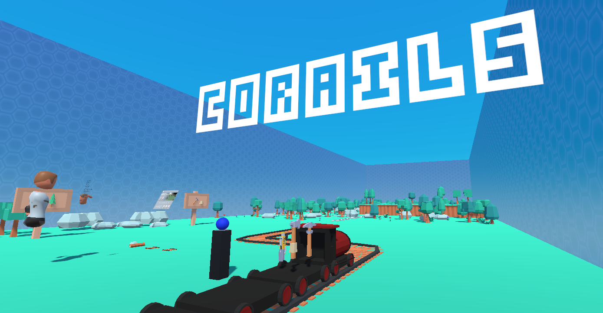

# CoRails

A co-operative multiplayer virtual reality experience where users build a railroad across procedurally generated terrain.

Instructions:

1. Use the Axe to harvest trees. Collect the wood and place it on the Wood Cart.
2. Use the Pickaxe to harvest rocks. Collect the stone and place it on the Stone Cart.
3. The Train will automatically convert 2x Wood and 1x Stone to 1x Track
4. Use the Vacuum Gun to place tracks:
 * Pick up the Vaccuum Gun and move it near the Track Cart to collect the Track
 * Aim it in front of where the rail currently ends
 * Use/Activate it to place a new section of Track
 
Keep harvesting and building until the train reaches the end, before it goes off the rails!